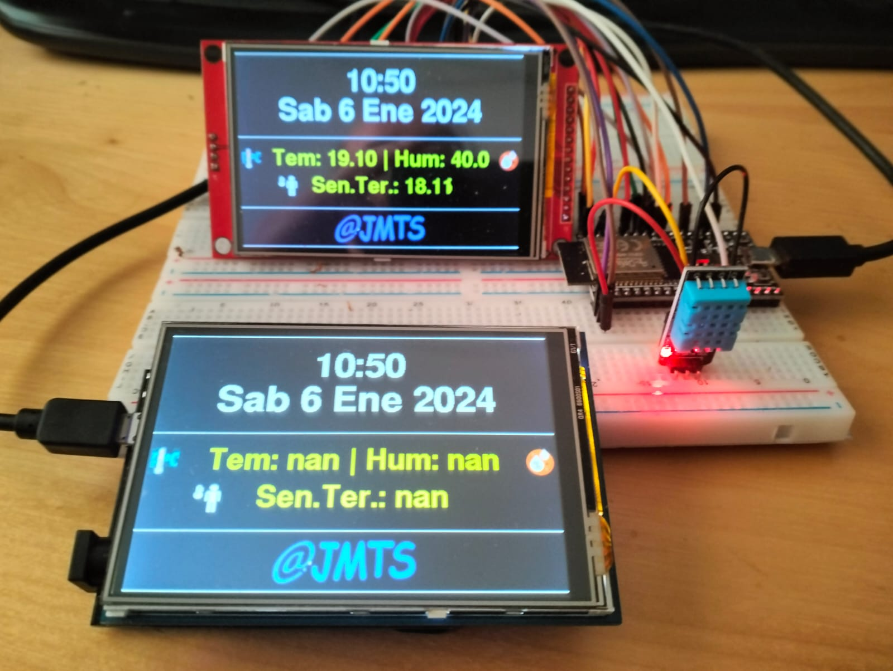

<h1>CONTROL DE TEMPERATURAS Y VENTILADORES</h1>

Es una combinación de los otros relojes que tengo publicados, se incluyen los dos otra vez y se le ha añadido un módulo CC1101 para el control de los dos ventiladores que tengo en mi domicilio y el envío de las temperaturas por UDP a un reloj central, desde el que se controlan los ventiladores.
Hay un Calendario con LCD 2004, un calendario TFT con Wemos D1 R32 y TFT shield 3.5", un sensor DHT sin pantalla para el exterior y uno Central que es donde se controlan los ventiladores y proximamente un aire acondicionado por infrarrojos

Se visualiza la Fecha, la Hora, el día de la semana, el día, el mes y el año.
Se actualiza solo el horario de verano.
Tambien se visualiza la temperatura, la humedad y la sensación termica de cuatro localizaciones.
La pantalla de control de ventilador solo se muestra en la pantalla local y dormitorio, porque es ahí donde tengo los ventiladores.
Aparece el botón A/A porque estoy trabajando para conectar el aire acondicionado del salón por infrarrojos con un módulo KY-005

La estructura de la base de datos y la publicación en la web la puedes ver en el otro Reloj."# Calendario_Temperatura_Humedad_TFT" 

Nota: "En la placa WEMOS D1 R32 no se muestran datos porque no hay conectado un sensor DHT".

El Calendario__Temperatura_Humedad esta probado con ESP32 DEVKIT y WEMOS D1 R32 (En la placa WEMOS D1 R32 con forma de arduino 1 para que funcione hay que realizar las modificaciones descritas en la libreria TFT_eSPI y en <a href="https://github.com/s60sc/Adafruit_TouchScreen" target="_blank">github.com/s60sc/Adafruit_TouchScreen</a> si quieres utilizar el touch panel).

El control del ventilador esta probado en un ESP32 DEVKIT y hay que modificar la libreria SmartRC-CC1101-Driver-Lib cambiando la variable spi por ccspi donde aparezca, adjunto la librería modificada.

He adjuntado los dos setup para los dos tipos de placa ESP32 en la libreria TFT_eSPI en el archivo User_Setup_Select.h se ha de seleccionar el que se desea, adjunto foto donde se ve.

CONFIGURACIÓN DE PINES PARA ESP32 DEV MODULE

DHT         PIN 22 

TFT CS      PIN 15

TFT RST     PIN 4

TFT O/C     PIN 2

TFT SCK     PIN 18

TFT SDI     PIN 23

TFT BL      5V o 3.3V   RETROILUMINACIÓN

TFT SD0     LIBRE

TFT TCK     PIN 18  TOUCH

TFT TCS     PIN 21  TOUCH

TFT TD1     PIN 23  TOUCH

TFT TD0     PIN 19  TOUCH

PINES CC1101 8 pines - para los de 10 pines son los mismos pines, mira la hoja de datos de tu modelo.

1	GND

2	VCC	    3.3V

3	GDO0	GPIO 14

4	CSN	    GPIO 5

5	SCK	    GPIO 18

6	MOSI	GPIO 23

7	MISO	GPIO 19

8	GDO2	GPIO 4 (No es necesario en modo transmisión, solo para recepción)

