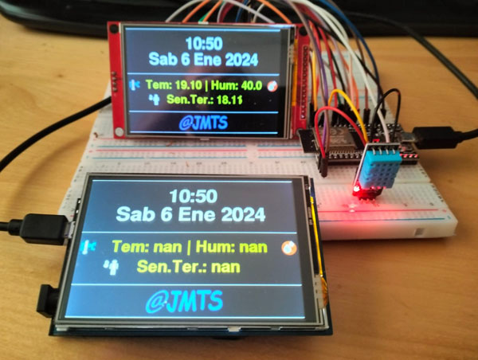
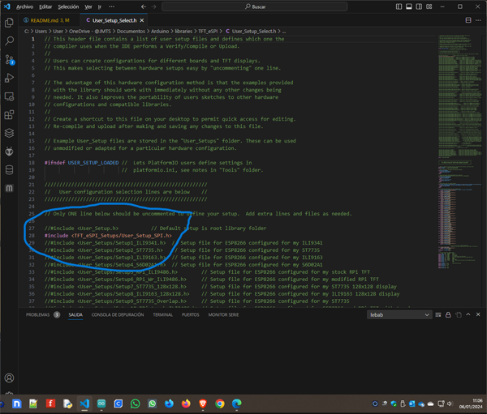

<h1>CALENDARIO CON TEMPERATURA, HUMEDAD Y SENSACIÓN TÉRMICA CON ESP32 Y ENVIO A BASE DE DATOS EN UNA TFT 480 x 320</h1>

<h2>ACTUALIZACIÓN DEL 10/02/2024</h2>

Se han actualizado el fichero tft.h. Ahora se utilizan Sprites para dibujar la pantalla y evitar el parpadeo.
Tambien se ha actulizado el fichero configuracion.h para asignar una ip fija en vez de dinamica.
Se han juntado todos los iconos en el fichero imagenes.h.
Ahora el envío de datos se realiza mendiante AsyncUDP y se evitan reinicios aleatorios del procesador.

Es una variación del otro reloj que tengo publicado la diferencia está en la TFT

Se visualiza la Fecha, la Hora, el día de la semana, el día, el mes y el año.
Se actualiza solo el horario de verano.
Tambien se visualiza la temperatura, la humedad y la sensación termica.

La estructura de la base de datos y la publicación en la web la puedes ver en el otro Reloj."# Calendario_Temperatura_Humedad_TFT" 

Nota: "En la placa WEMOS D1 R32 no se muestran datos porque no hay conectado un sensor DHT"

Probado con ESP32 DEVKIT y WEMOS D1 R32 (En la placa WEMOS D1 R32 con forma de arduino 1 para que funcione hay que realizar las modificaciones descritas en la libreria TFT_eSPI y en <a href="https://github.com/s60sc/Adafruit_TouchScreen" target="_blank">github.com/s60sc/Adafruit_TouchScreen</a> si quieres utilizar el touch panel)

He adjuntado los dos setup para los dos tipos de placas en la libreria TFT_eSPI en el archivo User_Setup_Select.h se ha de seleccionar el que se desea, adjunto foto donde se ve.

CONFIGURACIÓN DE PINES PARA ESP32 DEV MODULE

DHT         PIN 22 

TFT CS      PIN 15

TFT RST     PIN 4

TFT O/C     PIN 2

TFT SCK     PIN 18

TFT SDI     PIN 23

TFT BL      5V o 3.3V   RETROILUMINACIÓN

TFT SD0     LIBRE

TFT TCK     PIN 18  TOUCH

TFT TCS     PIN 21  TOUCH

TFT TD1     PIN 23  TOUCH

TFT TD0     PIN 19  TOUCH

PINES CC1101 8 pines - para los de 10 pines son los mismos pines, mira la hoja de datos de tu modelo.

1	GND
2	VCC	    3.3V
3	GDO0	GPIO 14 - 14
4	CSN	    GPIO 33 - 5
5	SCK	    GPIO 25 - 18
6	MOSI	GPIO 26 - 23
7	MISO	GPIO 32 - 19
8	GDO2	GPIO 4 (No es necesario en modo transmisión, solo para recepción)

